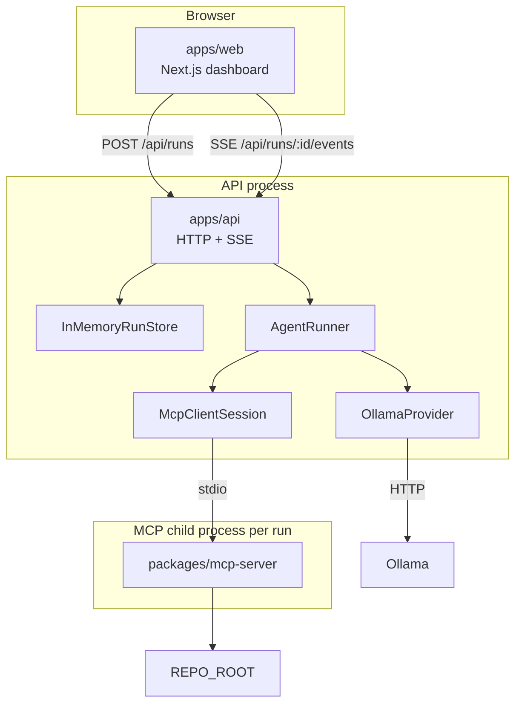

# CodePilot Agent

CodePilot is a local software-engineering **investigation** agent. A Next.js UI starts a run through a thin HTTP/SSE API; an explicit `AgentRunner` loop calls a local Ollama model and MCP repository tools, then returns a structured final report. It does not modify repository files. It is not an autonomous coding product and is not presented as production-ready.

## Demo

The demo target is `test-repository` (`mini-checkout`): a small TypeScript checkout app with an intentional volume-discount bug.

**Fixture fact (in the sample repo today):**

- Policy text and `qualifiesForVolumeDiscount` treat **$100.00** (`10000` cents) as qualifying (`>=`).
- `applyVolumeDiscount` in `src/apply-discount.ts` uses a strict `>` check against that threshold, so a cart of exactly `$100.00` does not get the discount.
- `tests/checkout.test.ts` expects the discount at exactly `$100.00`, so `npm test` fails until that comparison is fixed by a human.

A successful live demo (model-dependent) typically shows:

1. Starting a task from the dashboard
2. SSE timeline of steps and tool calls (`search_code`, `read_file`, `run_tests`, optionally `get_diff`)
3. A structured final report with investigated / identified / recommended / verified sections
4. Recommendations only—no file writes

Live investigation quality depends on the pulled Ollama model and local hardware. The example report later in this README is **illustrative**, not a CI-captured transcript.

## Why I Built This

Software investigation is a loop: search code, read files, run tests, interpret evidence, report findings. A single LLM completion hides state, tool failures, and stopping conditions. Giving a model unrestricted shell access mixes that loop with host risk.

An “agent” is useful here as a **bounded tool-calling loop with explicit state**: the model proposes the next inspection step; the runner executes only MCP tools; guardrails stop runaway loops; the outcome is a validated report rather than free-form prose. The engineering focus is boundaries (package split, MCP, path security, fixed commands, SSE, in-memory runs)—not claiming the system can own or repair a codebase by itself.

## Key Features

Implemented today:

- Explicit `AgentRunner` loop with in-memory `AgentState` (default max 10 steps)
- Ollama-backed `LlmProvider` (`OLLAMA_BASE_URL`, `OLLAMA_MODEL`)
- MCP client (`McpClientSession`) that spawns a stdio MCP server and discovers that server’s tool list at runtime
- MCP tools registered by the server: `search_code`, `read_file`, `run_tests`, `get_diff`
- Path security via `resolveRepoPath` (repository-root boundary)
- Fixed trusted commands for tests and git diff (no LLM-supplied shell/git argv)
- Structured `FinalReport` validation (investigation vocabulary; heuristic rejection of first-person “I modified/fixed…” claims)
- API `POST /api/runs` → `202 { runId }` with background execution
- SSE `GET /api/runs/:runId/events` for live progress and in-memory replay
- Next.js dashboard: task input, status, timeline, tool calls, final report, errors
- In-process guardrails: step limit, tool timeout, result size cap, repeated identical tool-call detection, clean failure
- Optional `AbortSignal` on `AgentRunner.run` (library-level; **no cancel HTTP endpoint** in the API yet)

## Architecture



| Layer | Package | Responsibility |
|-------|---------|----------------|
| UI | `apps/web` | Dashboard only; HTTP/SSE client to the API |
| API | `apps/api` | Validation, in-memory runs, SSE fan-out, starts the agent |
| Agent | `packages/agent` | LLM adapter + MCP client + runner loop + guardrails |
| MCP | `packages/mcp-server` | Repository tools + path/command policy |
| Target | `test-repository` | Demo codebase (not an npm workspace package) |

Separation rule: UI has no agent/MCP logic; API has no investigation reasoning or repository I/O; MCP has no prompts or tool-selection policy.

More detail: [`docs/architecture.md`](docs/architecture.md).

## How the Agent Works

`AgentRunner` owns one investigation run:

1. Create `AgentState`; append system prompt + user task
2. Discover tools once with `mcp.listTools()` (fail cleanly if discovery fails)
3. Loop until `completed` or `failed`:
   - Call `llm.chat` with messages and discovered tool definitions
   - If the model returns tool calls → for each call, enforce repeat limits, `mcp.callTool`, record result (including errors/timeouts/truncation), append a tool message, continue
   - If the model returns no tool calls → parse/validate `FinalReport` JSON → `completed` or clean `failed`
4. Also stop on max steps, repeated identical tool calls, LLM errors, or abort signal

Tool **selection** is model-driven. The runner does not hardcode the four tool names; it forwards whatever names/args the model requests to the MCP port. The **MCP server** still registers a fixed set of four tools today—discovery means “read the live server list,” not “tools appear from nowhere.”

Unknown or invalid tool calls become tool errors the model can observe; they do not always abort the run.

Success means a validated investigation report, not a patched repository.

More detail: [`docs/agent-design.md`](docs/agent-design.md).

## MCP Architecture

- **MCP Client** (`McpClientSession` in `packages/agent`): spawns the server over stdio, lists tools, calls tools, closes the session when the run ends
- **MCP Server** (`packages/mcp-server`): registers repository capabilities only; enforces path/command policy; no prompts
- **Transport**: one local child process per default API run; JSON-RPC on stdin/stdout; operational logs on stderr

Repository access from the agent goes through MCP only.

## Available Tools

| Tool | Input | Description |
|------|-------|-------------|
| `search_code` | `{ query }` | Recursive FS walk + substring match under `REPO_ROOT` (not ripgrep); returns paths, lines, snippets |
| `read_file` | `{ path }` | Read one file under `REPO_ROOT`; size cap; structured errors |
| `run_tests` | `{}` | Run host `TEST_COMMAND` only; timeout + bounded stdout/stderr |
| `get_diff` | `{}` | Fixed `git diff --no-ext-diff --no-color HEAD` only |

There is no `write_file` (or other mutation) tool.

## Security Boundaries

**What is protected**

- Filesystem tools resolve paths with `resolveRepoPath`: realpath-based containment under `REPO_ROOT`, null-byte rejection, traversal/symlink-escape rejection, structured `outside_repository` (and related) errors
- `run_tests` / `get_diff` do not take LLM-supplied command strings; argv comes from host config or a fixed git argv
- Shell metacharacters in `TEST_COMMAND` are rejected at parse time
- On Windows, trusted `.cmd`/`.bat` binaries may use `shell: true` only because Node cannot spawn them otherwise; argv remains fixed and metacharacter-checked

**What is not protected (honest scope)**

- The local API has **no authentication**. Anyone who can reach it can start runs.
- Starting a run executes the configured `TEST_COMMAND` in `REPO_ROOT`. Safety depends on the operator choosing a safe root and command.
- Path guards do not make an arbitrary `TEST_COMMAND` safe; they constrain file-path tools.
- Heuristic “did not modify code” checks on the final report are not a security boundary—they are output honesty checks.

## Reliability & Guardrails

In-process only (no Redis, queues, or distributed locks):

| Guardrail | Default | Behavior |
|-----------|---------|----------|
| Max steps | 10 | Fail without a report when the cap is hit |
| Tool timeout | 30s | Record as tool error; loop may continue |
| Tool result size | 32 KiB | Truncate; treat truncation as error/preview |
| Identical tool calls | 3 | Fail on repeated name + stable-args fingerprint |
| Clean failure | — | `failed` + error string + `finalReport=null` |
| Cancellation | `AbortSignal` on runner | Cooperative checks between steps/calls; not exposed as an API route |

Known limits of these guards: cooperative timeout (MCP child work is not OS-killed), truncation can hide evidence, identical-call detection can block legitimate repeated reads.

## Testing

Tests prioritize behavior and safety over line coverage.

| Package | Focus |
|---------|-------|
| `@codepilot/mcp-server` | Input validation, path traversal, fixed commands, structured tool errors, stdio smoke |
| `@codepilot/agent` | Max steps, repeated tool calls, `FinalReport` validation, tool failures, clean failure paths |
| `@codepilot/api` | Request validation, non-blocking run create, SSE lifecycle and terminal payloads |

Not chased: arbitrary 100% coverage, UI pixel/snapshot suites, live Ollama quality as CI.

```bash
npm test -w @codepilot/mcp-server
npm test -w @codepilot/agent
npm test -w @codepilot/api
```

## Design Decisions & Trade-offs

Important choices already in the codebase:

- Package split (UI / API / agent / MCP) for separation of concerns
- MCP (not direct FS/shell from the agent) for a capability boundary
- Stdio MCP for a local single-agent MVP
- One explicit `AgentRunner` (no multi-agent system, no agent framework)
- Ollama as the default local model backend
- No database; in-memory agent + run/SSE state
- SSE instead of WebSockets for one-way progress
- Structured `FinalReport` instead of free-form final prose
- No `write_file`; investigation and recommendation only
- Restricted `run_tests` / `get_diff` commands
- Simple recursive `search_code` (no ripgrep dependency)

Full write-ups: [`docs/decisions.md`](docs/decisions.md).

## Example Run

Illustrative successful path against the demo fixture (actual tool order and wording vary with the model):

**Task**

```text
Investigate why the volume discount fails at exactly $100.00
```

**Typical tool activity**

1. `search_code` for discount / threshold / `applyVolumeDiscount`
2. `read_file` on `src/apply-discount.ts`, `src/discount-policy.ts`, and `tests/checkout.test.ts`
3. `run_tests` to capture the failing suite
4. Final JSON report (no code changes)

**Example report shape**

```json
{
  "summary": "Volume discount fails at exactly $100.00 because applyVolumeDiscount uses a strict greater-than check against the $100 threshold.",
  "rootCause": "src/apply-discount.ts compares subtotalCents > VOLUME_DISCOUNT_THRESHOLD_CENTS (10000), while policy/tests expect qualification at >= 10000.",
  "filesInspected": [
    "src/apply-discount.ts",
    "src/discount-policy.ts",
    "tests/checkout.test.ts"
  ],
  "testsExecuted": ["npm test"],
  "testResult": "Failed: volume discount when the cart totals exactly $100.00.",
  "confidence": "high",
  "uncertainty": [
    "Did not inspect unrelated tax or cart modules beyond what the failing test required.",
    "No production logs were available."
  ],
  "investigated": [
    "Searched for discount and threshold logic.",
    "Read apply-discount, discount-policy, and checkout tests.",
    "Ran the repository test suite."
  ],
  "identified": [
    "checkout.test.ts expects a discount at exactly 10000 cents.",
    "applyVolumeDiscount uses > against the threshold constant.",
    "qualifiesForVolumeDiscount uses >= and disagrees with applyVolumeDiscount."
  ],
  "recommended": [
    "Change the comparison in applyVolumeDiscount from > to >= (or route through qualifiesForVolumeDiscount).",
    "Re-run npm test after the change."
  ],
  "verified": [
    "Observed failing test output from run_tests.",
    "Confirmed the operator mismatch in the inspected source files."
  ]
}
```

## Limitations

- Local MVP: single API process; in-memory runs/events disappear when the process exits
- No authentication, database, Redis, queue, WebSockets, or run-cancel HTTP API
- No repository mutation tools; cannot apply or re-verify its own patches in-repo
- Investigation quality depends on Ollama model + hardware; tool-calling can fail on smaller models
- Max 10 steps can stop a slow but useful investigation
- Tool timeouts are cooperative around the await; MCP child work is not OS-killed
- Truncated tool results can hide evidence
- Identical-call detector can block legitimate repeated reads
- Final-report “no modification claims” check is a simple regex heuristic
- `search_code` is a naive walk/substring search (correctness/perf limits vs ripgrep)
- Not production-hardened (no multi-tenant isolation, durable audit log, or SLA)

## Future Improvements

Not implemented. Possible directions only:

- Durable run history (database or file-backed store)
- Optional hosted LLM provider behind the same `LlmProvider` interface
- Stronger tool-timeout handling (process-level cancellation)
- HTTP cancel endpoint wired to `AbortSignal`
- Human-approved mutation tools with review/diff gates
- Multi-subscriber durable event log if more than one consumer is required
- Host-configured allowlisted command palette (still not free-form shell)
- Faster/safer code search (for example ripgrep) behind the same tool contract

## Local Setup

Requirements: Node.js 20+, npm, Git, and Ollama for live LLM runs.

```bash
cp .env.example .env
npm install
npm run typecheck
npm run build
```

Prepare the demo repository:

```bash
cd test-repository
npm install
npm test
cd ..
```

Pull a model (example):

```bash
ollama pull llama3.2
```

Run API and UI (separate terminals):

```bash
API_PORT=3001 npm start -w @codepilot/api
npm run dev -w @codepilot/web
```

Defaults from `.env.example`:

| Variable | Purpose |
|----------|---------|
| `OLLAMA_BASE_URL` / `OLLAMA_MODEL` | Local model |
| `REPO_ROOT` | Target repository root |
| `TEST_COMMAND` | Trusted test argv |
| `API_PORT` | API listen port (`3001`) |
| `NEXT_PUBLIC_API_URL` | Web → API base |
| `WEB_ORIGIN` | CORS origin for the UI |

Open the UI (default `http://localhost:3000`) and start a task against the API.

## Project Structure

```text
apps/web              Next.js investigation dashboard
apps/api              HTTP API + SSE + in-memory runs
packages/agent        AgentRunner, state, Ollama adapter, MCP client
packages/mcp-server   Stdio MCP server, tools, path security
test-repository       Standalone demo app with intentional bug
docs/                 architecture, agent-design, decisions, layout
```

## Tech Stack

- Node.js 20+ / npm workspaces
- TypeScript
- Next.js / React (`apps/web`)
- Node `http` server + SSE (`apps/api`)
- Zod (HTTP body validation and MCP tool input schemas)
- Vitest (package tests)
- Model Context Protocol (official TypeScript client/server SDKs)
- Ollama HTTP chat API (local LLM)
- Git (fixed `get_diff` argv only)
