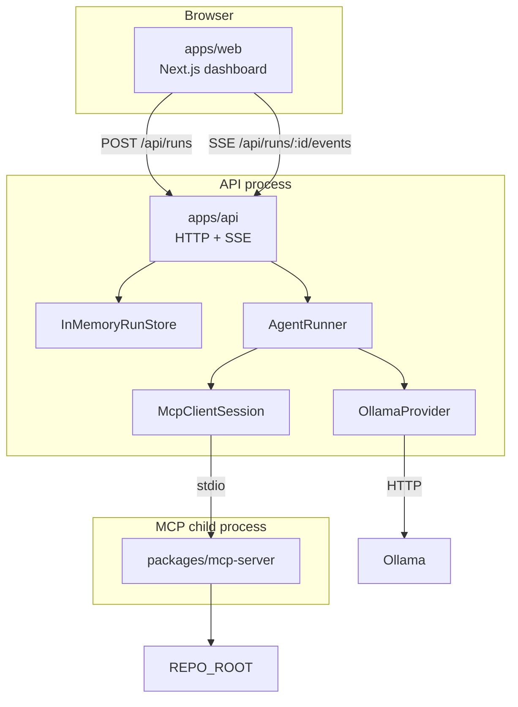

# CodePilot Agent

CodePilot is a local software-engineering investigation agent. A Next.js UI starts a run through a thin HTTP/SSE API; an explicit `AgentRunner` loop uses a local Ollama model and MCP repository tools to inspect a target codebase, then returns a structured final report. It does not modify repository files and is not an autonomous coding system.

## Demo

The demo target is `test-repository` (`mini-checkout`), a small TypeScript app with an intentional pricing bug: volume discount fails at exactly `$100.00` because the threshold uses `>` instead of `>=`.

A typical demo shows:

1. Starting a task from the dashboard
2. Live SSE timeline of steps and tool calls (`search_code`, `read_file`, `run_tests`, optionally `get_diff`)
3. A structured final report that separates investigated / identified / recommended / verified
4. No file writes—recommendations only

Investigation quality depends on the local Ollama model and hardware.

## Why I Built This

Software investigation is a loop: search code, read files, run tests, interpret evidence, and report findings. Wiring that loop naively (LLM + unrestricted shell) mixes reasoning with host risk. Treating it as a single chat completion also hides state, tool failures, and stopping conditions.

An agent is useful here as a **bounded tool-calling loop with explicit state**: the model proposes the next inspection step; the runner executes only MCP tools; guardrails stop runaway loops; the outcome is a validated report rather than free-form prose. The engineering focus is boundaries (MCP, path security, fixed commands, SSE, in-memory runs)—not claiming the system can own a codebase.

## Key Features

- Explicit `AgentRunner` loop with in-memory `AgentState` (default max 10 steps)
- Ollama-backed `LlmProvider` (`OLLAMA_BASE_URL`, `OLLAMA_MODEL`)
- MCP client (`McpClientSession`) that spawns a stdio MCP server and discovers tools dynamically
- MCP tools: `search_code`, `read_file`, `run_tests`, `get_diff`
- Path security via `resolveRepoPath` (repository-root boundary)
- Fixed trusted commands for tests and git diff (no LLM-supplied shell)
- Structured `FinalReport` validation (investigation vocabulary; rejects “I modified/fixed…” claims)
- API `POST /api/runs` → `202 { runId }` and background execution
- SSE `GET /api/runs/:runId/events` for live progress
- Next.js dashboard: task input, status, timeline, tool calls, final report, errors
- In-process guardrails: step limit, tool timeout, result size cap, repeated identical tool-call detection, clean failure, optional `AbortSignal`

## Architecture



| Layer | Package | Responsibility |
|-------|---------|----------------|
| UI | `apps/web` | Dashboard only; talks to the API |
| API | `apps/api` | Validation, in-memory runs, SSE, starts the agent |
| Agent | `packages/agent` | LLM + MCP client + runner loop |
| MCP | `packages/mcp-server` | Repository tools + path/command policy |
| Target | `test-repository` | Demo codebase (not a workspace package) |

More detail: [`docs/architecture.md`](docs/architecture.md).

## How the Agent Works

`AgentRunner` owns one investigation run:

1. Create `AgentState`; append system prompt + user task
2. Discover tools with `mcp.listTools()`
3. Loop until completed or failed:
   - Call `llm.chat` with messages and discovered tools
   - If the model returns tool calls → execute each via `mcp.callTool`, record results, append tool messages, continue
   - If the model returns no tool calls → parse/validate `FinalReport` JSON → complete or fail cleanly
4. Stop early on max steps, repeated identical tool calls, LLM/MCP discovery failures, invalid final JSON, or abort

Tool selection is model-driven. The runner does not hardcode the four tool names; it executes names requested through the MCP port. Success means a validated investigation report, not a patched repository.

More detail: [`docs/agent-design.md`](docs/agent-design.md).

## MCP Architecture

- **MCP Client** (`McpClientSession` in `packages/agent`): spawns the server over stdio, lists tools, calls tools, closes the session
- **MCP Server** (`packages/mcp-server`): registers repository capabilities only; no prompts or tool-selection policy
- **Transport**: local child process, JSON-RPC on stdin/stdout; logs on stderr

The agent reaches the repository only through MCP. Path security and command restrictions are enforced in the server.

## Available Tools

| Tool | Input | Description |
|------|-------|-------------|
| `search_code` | `{ query }` | Search under `REPO_ROOT`; returns paths, lines, snippets |
| `read_file` | `{ path }` | Read one file under `REPO_ROOT`; structured errors |
| `run_tests` | `{}` | Run host `TEST_COMMAND` only; bounded output |
| `get_diff` | `{}` | Fixed `git diff --no-ext-diff --no-color HEAD` |

There is no `write_file` tool.

## Security Boundaries

**Repository paths** (`resolveRepoPath`):

- `REPO_ROOT` is the trust boundary
- Paths are resolved with real filesystem semantics (not string `"../"` checks alone)
- Symlink targets that leave the root are rejected
- Null bytes, empty paths, and outside absolute paths are rejected
- Filesystem tools return structured errors such as `outside_repository`

**Commands**:

- `run_tests`: no LLM command input; only configured `TEST_COMMAND` argv; shell metacharacters rejected at parse time
- `get_diff`: fixed git argv only
- Timeouts and stdout/stderr size caps apply

The model may request tools; it cannot choose arbitrary shell or git strings.

## Reliability & Guardrails

In-process only (no Redis, queues, or distributed locks):

| Guardrail | Default | Behavior |
|-----------|---------|----------|
| Max steps | 10 | Fail without a report when the cap is hit |
| Tool timeout | 30s | Record as tool error; loop may continue |
| Tool result size | 32 KiB | Truncate; treat truncation as error/preview |
| Identical tool calls | 3 | Fail on repeated name + args fingerprint |
| Clean failure | — | `failed` + error string + `finalReport=null` |
| Cancellation | optional `AbortSignal` | Cooperative checks between steps/calls |

Limitations of these guards (cooperative timeout, possible truncation of useful evidence, blocking legitimate identical re-reads) are intentional MVP bounds.

## Testing

Tests prioritize behavior and safety over line coverage.

| Package | Focus |
|---------|-------|
| `@codepilot/mcp-server` | Input validation, path traversal, fixed commands, structured tool errors, stdio smoke |
| `@codepilot/agent` | Max steps, repeated tool calls, `FinalReport` validation, tool failures, clean failure paths |
| `@codepilot/api` | Request validation, non-blocking run create, SSE lifecycle and terminal payloads |

Not chased: arbitrary 100% coverage, UI pixel suites, live Ollama quality as CI.

```bash
npm test -w @codepilot/mcp-server
npm test -w @codepilot/agent
npm test -w @codepilot/api
```

## Design Decisions & Trade-offs

Important choices already in the codebase:

- MCP (not direct FS/shell from the agent) for a typed capability boundary
- Stdio MCP for a local single-agent MVP
- One explicit `AgentRunner` (no multi-agent system, no agent framework)
- Ollama as the default local model backend
- No database; in-memory agent + run/SSE state
- SSE instead of WebSockets for one-way progress
- No `write_file`; investigation and recommendation only
- Restricted `run_tests` / `get_diff` commands

Full write-ups: [`docs/decisions.md`](docs/decisions.md).

## Example Run

Task:

```text
Investigate why the volume discount fails at exactly $100.00
```

Typical tool activity:

1. `search_code` for discount / pricing
2. `read_file` on pricing source and the failing test
3. `run_tests` to capture the failure
4. Final JSON report (no code changes)

Example report shape:

```json
{
  "summary": "Volume discount fails at exactly $100 because the threshold uses a strict greater-than comparison.",
  "rootCause": "applyVolumeDiscount uses `subtotal > 100` instead of `subtotal >= 100`, so $100.00 never qualifies.",
  "filesInspected": ["src/pricing.ts", "tests/pricing.test.ts"],
  "testsExecuted": ["npm test"],
  "testResult": "Failed: volume discount at exactly $100.00 expectation not met.",
  "confidence": "high",
  "uncertainty": [
    "Did not inspect unrelated checkout modules.",
    "No production logs were available."
  ],
  "investigated": [
    "Searched for discount and pricing logic.",
    "Read pricing implementation and failing test.",
    "Ran the repository test suite."
  ],
  "identified": [
    "Failing test asserts a discount at exactly $100.00.",
    "Implementation compares with `>` rather than `>=`."
  ],
  "recommended": [
    "Change the threshold comparison in applyVolumeDiscount from `>` to `>=`.",
    "Re-run npm test after the change."
  ],
  "verified": [
    "Observed the failing test output from run_tests.",
    "Confirmed the comparison operator in the inspected source file."
  ]
}
```

## Limitations

- Local MVP: single API process, in-memory runs/events (lost on process exit)
- No authentication, database, Redis, queue, or WebSockets
- No repository mutation tools; cannot apply or verify its own patches in-repo
- Investigation quality depends on the Ollama model and machine resources
- Max 10 steps can stop a slow but useful investigation
- Tool timeouts are cooperative around the await; MCP child work is not OS-killed
- Truncated tool results can hide evidence the model needed
- Identical-call detector can block legitimate repeated reads of the same path/query
- Not production-hardened (no multi-tenant isolation, durable audit log, or SLA claims)

## Future Improvements

Not implemented. Possible directions only:

- Durable run history (database or file-backed store)
- Optional hosted LLM provider behind the same `LlmProvider` interface
- Stronger tool-timeout handling (process-level cancellation)
- Human-approved mutation tools with review/diff gates
- Multi-subscriber durable event log if more than one consumer is required
- Broader allowlisted command palette still host-configured (not free-form shell)

## Local Setup

Requirements: Node.js 20+, npm, Git, and Ollama for live LLM runs.

```bash
cp .env.example .env
npm install
npm run typecheck
npm run build
```

Prepare the demo repository:

```bash
cd test-repository
npm install
npm test
cd ..
```

Pull a model (example):

```bash
ollama pull llama3.2
```

Run API and UI (separate terminals):

```bash
API_PORT=3001 npm start -w @codepilot/api
npm run dev -w @codepilot/web
```

Defaults from `.env.example`:

| Variable | Purpose |
|----------|---------|
| `OLLAMA_BASE_URL` / `OLLAMA_MODEL` | Local model |
| `REPO_ROOT` | Target repository root |
| `TEST_COMMAND` | Trusted test argv |
| `API_PORT` | API listen port (`3001`) |
| `NEXT_PUBLIC_API_URL` | Web → API base |
| `WEB_ORIGIN` | CORS origin for the UI |

Open the UI (default `http://localhost:3000`) and start a task against the API.

## Project Structure

```text
apps/web              Next.js investigation dashboard
apps/api              HTTP API + SSE + in-memory runs
packages/agent        AgentRunner, state, Ollama adapter, MCP client
packages/mcp-server   Stdio MCP server, tools, path security
test-repository       Standalone demo app with intentional bug
docs/                 architecture, agent-design, decisions, layout
```

## Tech Stack

- Node.js 20+ / npm workspaces
- TypeScript
- Next.js / React (`apps/web`)
- Node HTTP server + SSE (`apps/api`)
- Zod (request validation)
- Vitest (package tests)
- Model Context Protocol (official client/server SDKs)
- Ollama HTTP chat API (local LLM)
- Git (fixed `get_diff` argv only)
