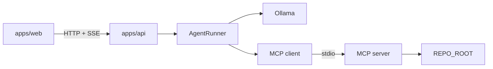

# CodePilot Agent

Local investigation agent for software-engineering tasks.

A Next.js UI starts a run through a thin HTTP/SSE API. An explicit `AgentRunner` loop calls a local Ollama model, uses MCP tools to inspect a repository, and returns a structured final report. The agent does not modify files. It is a local MVP, not a production or autonomous coding system.

```text
UI  →  API (validate, in-memory run, SSE)
         →  AgentRunner (Ollama + tool loop)
              →  MCP client (stdio)
                   →  MCP server (path-guarded tools)
                        →  REPO_ROOT
```

The browser never talks to Ollama or MCP directly.

## Demo

Target repo: `test-repository` (`mini-checkout`), with an intentional volume-discount bug.

- Policy / `qualifiesForVolumeDiscount` treat `$100.00` (`10000` cents) as qualifying (`>=`)
- `applyVolumeDiscount` in `src/apply-discount.ts` uses `>` against that threshold
- `tests/checkout.test.ts` expects a discount at exactly `$100.00`, so `npm test` fails until a human changes the comparison

A live run (model-dependent) typically:

1. Start a task in the dashboard
2. Stream steps/tool calls over SSE (`search_code`, `read_file`, `run_tests`, optionally `get_diff`)
3. Render a structured report (`investigated` / `identified` / `recommended` / `verified`)
4. Recommend a fix — no writes

Quality depends on the local Ollama model and hardware. The sample report below is illustrative, not a CI transcript.

**Example task**

```text
Investigate why the volume discount fails at exactly $100.00
```

**Illustrative report fields**

```json
{
  "summary": "Volume discount fails at exactly $100.00 because applyVolumeDiscount uses > against the threshold.",
  "rootCause": "src/apply-discount.ts uses subtotalCents > 10000; policy/tests expect >= 10000.",
  "filesInspected": ["src/apply-discount.ts", "src/discount-policy.ts", "tests/checkout.test.ts"],
  "testsExecuted": ["npm test"],
  "testResult": "Failed: volume discount at exactly $100.00.",
  "confidence": "high",
  "uncertainty": ["Did not inspect unrelated modules."],
  "investigated": ["Searched discount logic", "Read sources and tests", "Ran npm test"],
  "identified": ["Test expects discount at 10000 cents", "applyVolumeDiscount uses >"],
  "recommended": ["Change > to >= (or use qualifiesForVolumeDiscount)", "Re-run npm test"],
  "verified": ["Failing test output from run_tests", "Operator mismatch in source"]
}
```

## Architecture



| Layer | Package | Role |
|-------|---------|------|
| UI | `apps/web` | Dashboard; API client only |
| API | `apps/api` | Zod validation, in-memory runs, SSE, starts agent |
| Agent | `packages/agent` | `AgentRunner`, state, Ollama adapter, MCP client |
| MCP | `packages/mcp-server` | Repo tools + path/command policy |
| Target | `test-repository` | Demo repo (not a workspace package) |

**Boundaries:** UI has no agent/MCP logic. API has no investigation reasoning or repo I/O. MCP has no prompts or tool selection.

**Agent loop (`AgentRunner`):**

1. Create `AgentState`; append system prompt + task
2. `mcp.listTools()` once
3. Loop: `llm.chat` → tool calls via `mcp.callTool` (record results) **or** validate `FinalReport` and stop
4. Also stop on max steps, repeated identical calls, LLM/discovery failure, or `AbortSignal`

Tool names are not hardcoded in the runner; the MCP server registers a fixed set of four tools. Success means a validated report, not a patched tree.

Details: [docs/architecture.md](docs/architecture.md), [docs/agent-design.md](docs/agent-design.md).

## MCP

| Piece | Location | Responsibility |
|-------|----------|----------------|
| Client | `McpClientSession` in `packages/agent` | Spawn server, `listTools`, `callTool`, close |
| Server | `packages/mcp-server` | Tools + path/command policy; no LLM |
| Transport | stdio JSON-RPC | One child process per default API run; logs on stderr |

MCP keeps repository I/O behind a capability boundary. Path and command policy live in the server; the agent only uses `listTools` / `callTool`.

## Tools

| Tool | Input | Behavior |
|------|-------|----------|
| `search_code` | `{ query }` | Recursive walk + substring match under `REPO_ROOT` |
| `read_file` | `{ path }` | Read one file; size cap; structured errors |
| `run_tests` | `{}` | Host `TEST_COMMAND` only; timeout + bounded output |
| `get_diff` | `{}` | Fixed `git diff --no-ext-diff --no-color HEAD` |

No `write_file` or other mutation tools.

## Security

**Enforced**

- `resolveRepoPath`: realpath containment under `REPO_ROOT`; rejects null bytes, traversal, and symlink escapes
- Filesystem tools return structured errors (e.g. `outside_repository`)
- `run_tests` / `get_diff` ignore LLM-supplied commands; argv is host-configured or fixed
- `TEST_COMMAND` rejects shell metacharacters at parse time
- On Windows, `.cmd`/`.bat` may use `shell: true` only so Node can spawn them; argv stays fixed

**Not protected (MVP scope)**

- No API authentication
- A reachable API can start runs that execute `TEST_COMMAND` in `REPO_ROOT`
- Path guards do not make an arbitrary `TEST_COMMAND` safe
- Final-report “I modified…” rejection is a heuristic honesty check, not a security control

## Reliability

In-process guardrails only (no Redis, queues, or distributed locks):

| Guardrail | Default | Behavior |
|-----------|---------|----------|
| Max steps | 10 | Fail without a report |
| Tool timeout | 30s | Error result; loop may continue |
| Tool result size | 32 KiB | Truncate as error/preview |
| Identical tool calls | 3 | Fail on repeated name + args fingerprint |
| Clean failure | — | `failed` + error; `finalReport=null` |
| Cancel | `AbortSignal` on runner | Cooperative; no HTTP cancel route |

Limits: timeout does not OS-kill MCP children; truncation can hide evidence; identical-call detection can block legitimate re-reads.

## Testing

Focus: behavior and safety, not coverage percentage.

| Package | Covers |
|---------|--------|
| `@codepilot/mcp-server` | Input validation, path traversal, fixed commands, tool errors, stdio smoke |
| `@codepilot/agent` | Max steps, repeated calls, `FinalReport` validation, tool/LLM failures |
| `@codepilot/api` | Request validation, non-blocking create, SSE lifecycle and terminal payloads |

```bash
npm test -w @codepilot/mcp-server
npm test -w @codepilot/agent
npm test -w @codepilot/api
```

Not in CI: UI snapshots, live Ollama quality.

## Trade-offs

| Choice | Why | Cost |
|--------|-----|------|
| MCP vs direct FS/shell | Capability + policy boundary | Extra process |
| Stdio MCP | Simple local hosting | Not a shared multi-client service |
| Explicit `AgentRunner` | Visible control flow | No framework features |
| Ollama default | Local, no cloud API key | Model/hardware dependent |
| In-memory runs/SSE | Minimal MVP infra | Lost on process exit |
| SSE vs WebSockets | One-way progress | No bidirectional channel |
| No `write_file` | Investigation only | Cannot apply fixes |
| Fixed `TEST_COMMAND` / git argv | Avoid model-chosen shell | Less ad-hoc flexibility |
| Naive `search_code` | Few dependencies | Weaker than ripgrep |

Full records: [docs/decisions.md](docs/decisions.md).

## Limitations

- Single API process; in-memory state only
- No auth, database, Redis, queue, WebSockets, or cancel HTTP API
- No repo mutation; cannot verify its own patches
- Local model quality varies
- Hard step/result/timeout limits can cut short useful work
- Not multi-tenant or production-hardened

**Production (not implemented):** auth, durable storage, stronger isolation around `REPO_ROOT`/`TEST_COMMAND`, hosted model option behind `LlmProvider`, process-level tool cancel, audit logging.

## Local Setup

Requires Node.js 20+, npm, Git, and Ollama for live LLM runs.

```bash
cp .env.example .env
npm install
npm run typecheck
npm run build

cd test-repository && npm install && npm test && cd ..

ollama pull llama3.2
```

```bash
# terminal 1
API_PORT=3001 npm start -w @codepilot/api

# terminal 2
npm run dev -w @codepilot/web
```

Open `http://localhost:3000` (API default `http://localhost:3001`).

| Variable | Purpose |
|----------|---------|
| `OLLAMA_BASE_URL` / `OLLAMA_MODEL` | Local model |
| `REPO_ROOT` | Target repository |
| `TEST_COMMAND` | Trusted test argv |
| `API_PORT` | API port (`3001`) |
| `NEXT_PUBLIC_API_URL` | Web → API base |
| `WEB_ORIGIN` | CORS origin |

## Project Structure

```text
apps/web              Next.js dashboard
apps/api              HTTP + SSE + in-memory runs
packages/agent        AgentRunner, state, Ollama, MCP client
packages/mcp-server   Stdio MCP server, tools, path security
test-repository       Demo app with intentional bug
docs/                 architecture, agent-design, decisions, layout
```

## Tech Stack

- Node.js 20+ / npm workspaces / TypeScript
- Next.js, React (`apps/web`)
- Node `http` + SSE (`apps/api`)
- Zod, Vitest
- Model Context Protocol (official TS client/server SDKs)
- Ollama HTTP chat API
- Git (fixed `get_diff` argv only)
