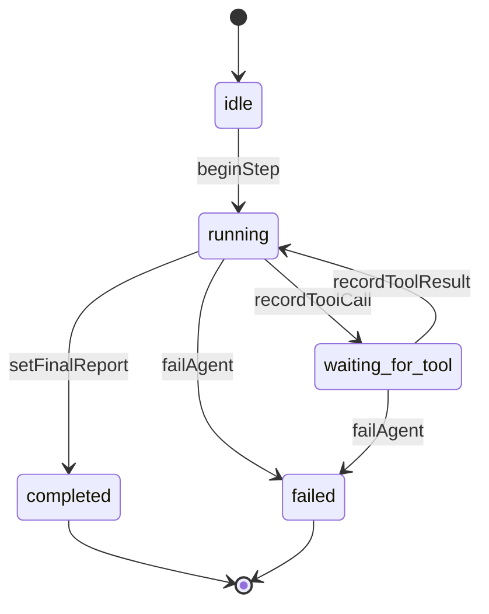
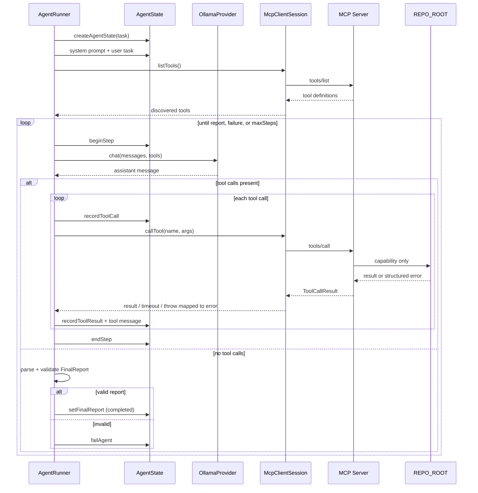

# Agent design

This document describes `packages/agent` as implemented today: in-memory state, an Ollama-backed LLM adapter, an MCP tool port, and an explicit `AgentRunner` loop.

It does **not** claim strong autonomy. CodePilot is a bounded investigation loop: a local model proposes tool calls; the runner executes them through MCP; the run ends with a validated JSON report or a clean failure.

## What makes this an Agent

In this codebase, “agent” means a **stateful loop** that can:

1. Keep conversation and tool history in `AgentState`
2. Ask a model what to do next (answer or call tools)
3. Execute tool calls against the repository through MCP
4. Feed tool results back into the next model turn
5. Stop when it produces a validated `FinalReport`, hits a guardrail, or fails cleanly

That is more than a single LLM completion, and more than “call tools once.” It is still a narrow system:

- Default max **10** steps
- Tools are whatever the MCP server exposes (today: search, read, run fixed tests, get fixed diff)
- No write/mutation tools
- No planning subsystem, memory store, sub-agents, or self-modification
- Quality depends on the local Ollama model

The runner does not invent filesystem or shell access; it only forwards model-requested tool names/args to MCP.

## LLM call vs tool-calling loop vs Agent

| Concept | What it is here | What it is not |
|---------|-----------------|----------------|
| **LLM call** | One `LlmProvider.chat({ messages, tools })` request/response | Not a full investigation; no durable run state by itself |
| **Tool-calling loop** | Repeated: model returns tool calls → execute tools → append tool messages → call model again | Not automatic goal achievement; still one conversation pattern |
| **Agent (`AgentRunner`)** | The owned run: `AgentState`, events, guardrails, MCP discovery, report validation, clean failure | Not an autonomous engineer; it investigates within fixed bounds and returns a structured report |

```text
LLM call          = one model turn
Tool-calling loop = several turns connected by tool results
Agent             = that loop + explicit state + stopping rules + structured outcome
```

## Agent state

State is a single in-memory `AgentState` object (`packages/agent/src/state.ts`). There is no database or external state library.



### Core types

| Type | Role |
|------|------|
| `AgentState` | One investigation run |
| `AgentStatus` | `idle` \| `running` \| `waiting_for_tool` \| `completed` \| `failed` |
| `AgentStep` | One loop iteration (index, tool call ids, timestamps) |
| `ToolCall` / `ToolResult` | Requested MCP call and recorded result |
| `AgentEvent` | Append-only timeline (`status`, `step_start`, `tool_call`, `tool_result`, `error`, `report`, `done`, …) |
| `FinalReport` | Structured completion payload |

### `AgentState` fields

- `task` — user investigation request
- `messages` — system/user/assistant/tool buffer sent to the LLM
- `currentStep` / `steps` — step accounting
- `status` — lifecycle status
- `toolCalls` / `toolResults` — tool activity for the run
- `events` — ordered events for API/UI streaming
- `finalReport` — `null` until successful completion
- `maxSteps` — hard cap (default `10`)
- `error` — set on failure; cleared on successful report

Helpers (`createAgentState`, `beginStep` / `endStep`, `recordToolCall` / `recordToolResult`, `setFinalReport`, `failAgent`) mutate that object in place.

## Agent loop

`AgentRunner.run(task)` owns the investigation.

High-level behavior:

1. Create state; append system prompt + user task
2. `mcp.listTools()` once (fail cleanly if discovery fails)
3. While status is not `completed` or `failed`:
   - Enforce max steps
   - `beginStep`
   - `llm.chat` with current messages and discovered tools
   - If the model returns tool calls → execute them, append tool messages, `endStep`, continue
   - Else treat content as a final JSON report → validate → `setFinalReport` or `failAgent`



## Tool selection

Tool selection is **model-driven**, not a separate planner:

- The runner discovers tools from MCP (`listTools`) and maps them to `LlmToolDefinition`s
- Those definitions are passed into each `llm.chat` call
- The model may return zero or more `toolCalls` (`name` + `arguments`)
- The runner does not hardcode the four MCP tool names; it executes whatever names the model requests through the MCP port
- The system prompt instructs the model to use only tools and not invent FS/shell access

If the model picks a bad tool or bad args, MCP returns an error result (or the call fails); the runner records that and usually continues.

## Tool execution

For each model-requested tool call, the runner:

1. Checks the repeated identical-call limit (`name` + stable JSON args)
2. Records the `ToolCall` (status → `waiting_for_tool`)
3. Awaits `mcp.callTool` inside `withTimeout` (default **30s**)
4. Maps timeouts and thrown MCP errors into error-shaped tool results (does not crash the process)
5. Never opens files or runs shell/git itself—only MCP does

## Tool results

Each result is normalized into state and the message buffer:

- Content is stringified from MCP `structuredContent` or `content`
- Oversized payloads are truncated (default **32 KiB**); truncation is treated as an error result with a preview
- `recordToolResult` stores `isError`, content, optional structured payload
- A `role: "tool"` message is appended so the next LLM call sees the outcome

Tool failures are **observable**, not always fatal: the loop typically continues until a valid report or a stopping condition.

## Stopping conditions

The run stops when any of these happen:

| Condition | Outcome |
|-----------|---------|
| Valid `FinalReport` JSON in a non-tool assistant turn | `completed`, `finalReport` set |
| `currentStep >= maxSteps` without a report | `failed` |
| Repeated identical tool call exceeds limit (default **3**) | `failed` |
| `listTools` fails | `failed` |
| LLM call throws (`LlmError` or other) | `failed` |
| Final assistant text is not valid `FinalReport` JSON | `failed` |
| `AbortSignal` aborts | `failed` with cancellation message |

There is no “keep going forever until the bug is fixed” mode. The agent does not apply code changes, so “success” means a validated investigation report, not a patched repository.

## Guardrails

Implemented in `packages/agent/src/guardrails.ts` and enforced by `AgentRunner`:

| Guardrail | Default | Behavior |
|-----------|---------|----------|
| Max steps | `10` | Fail without a report when the cap is hit |
| Tool timeout | `30s` | Record timeout as tool error; continue loop |
| Max tool result size | `32 KiB` | Truncate; mark as error/truncated preview |
| Identical tool calls | `3` | Fail when the same name+args fingerprint repeats past the limit |
| Clean failure | — | `status=failed`, non-empty `error`, `finalReport=null`, `error`/`done` events |
| Cancellation | optional `signal` | Cooperative checks between steps/tool calls |

These limits exist because local models can loop, hang on tools, or dump huge outputs. They are intentional MVP bounds, not a claim of robust long-horizon autonomy.

## Structured final result

When the model returns no tool calls, the runner parses JSON from the assistant content and validates a `FinalReport`:

- Required strings: `summary`, `rootCause`, `testResult`, `confidence`
- Required string arrays: `filesInspected`, `testsExecuted`, `uncertainty`, `investigated`, `identified`, `recommended`, `verified`
- Rejects first-person claims that code was modified/fixed/written (investigation only)

Claim vocabulary expected by the system prompt:

- **investigated** — what was looked at
- **identified** — facts from tool evidence
- **recommended** — suggested next steps that were **not** applied
- **verified** — outcomes confirmed by tools (for example test output)

On success: `setFinalReport` → `status=completed`, `report` + `done` events.

## Failure handling

Failures go through `failAgent`:

- `status = failed`
- `error` = non-empty message
- `finalReport` remains `null`
- `error` and `done` events are appended

`isCleanFailureState` checks that pattern for tests and callers.

Examples of clean failures: max steps, invalid final JSON, model errors, MCP discovery failure, repeated identical tool calls, cancellation.

Examples that usually do **not** immediately fail the run: MCP tool `isError` results, tool timeouts, truncated oversized results (recorded, then the model may continue).

## LLM adapter

The runner depends only on `LlmProvider.chat`. The implemented backend is Ollama (`OLLAMA_BASE_URL`, `OLLAMA_MODEL`). Connection and missing-model problems surface as explicit LLM error types and fail the run cleanly.

## Limits of autonomy (intentional)

- Bounded steps and guardrails
- Read/investigate tools only; no repository writes
- No multi-agent orchestration or long-term memory
- No guarantee the model finds the real root cause
- Demo quality tracks the pulled Ollama model and local hardware

Related: `docs/architecture.md` (system boundaries), `README.md` (guardrails and example report).
