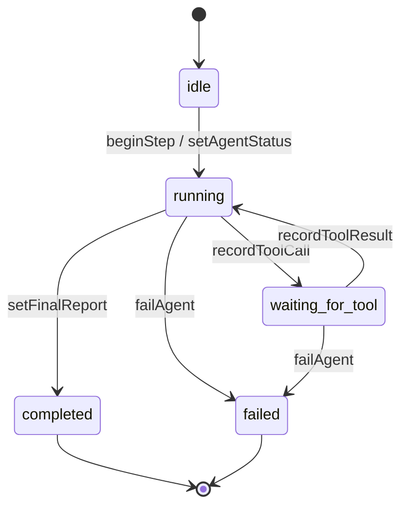
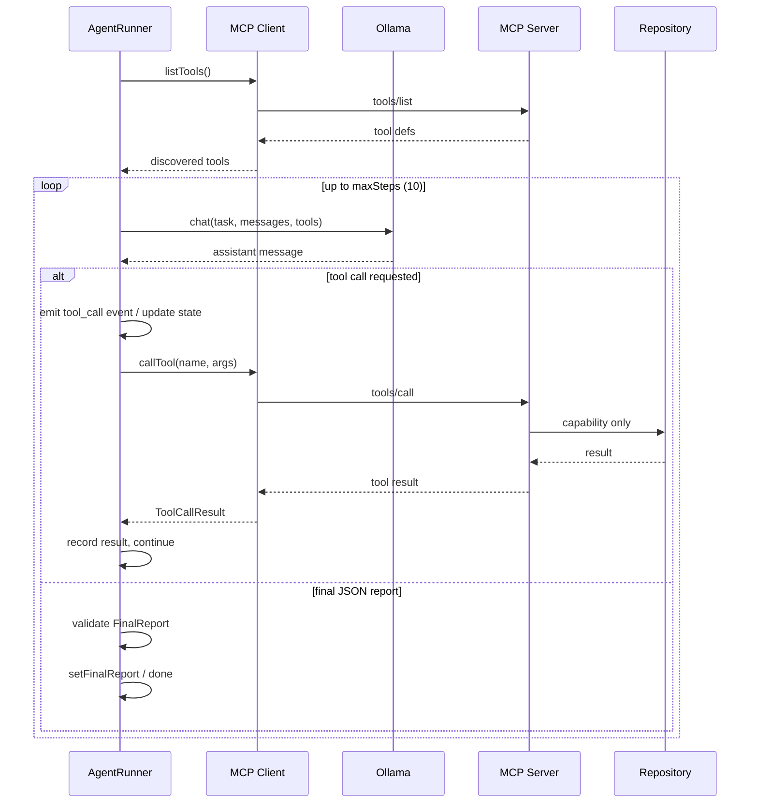

# Agent design

Current scope: in-memory agent state/types, MCP client, Ollama LLM adapter, and `AgentRunner` loop.

## State model

### Core types

| Type | Role |
|------|------|
| `AgentState` | In-memory run state for one investigation task |
| `AgentStatus` | `idle` \| `running` \| `waiting_for_tool` \| `completed` \| `failed` |
| `AgentStep` | One loop iteration (`index`, optional thought, tool call ids, timestamps) |
| `ToolCall` | Requested MCP tool invocation |
| `ToolResult` | MCP tool response linked by `toolCallId` |
| `AgentEvent` | Append-only streamable timeline entry |
| `FinalReport` | Structured outcome written when the run completes |

### `AgentState` fields

- `task` — investigation request
- `messages` — conversation buffer for the LLM loop
- `currentStep` — latest step index (`0` before the first step)
- `status` — lifecycle status above
- `steps` — step records
- `toolCalls` / `toolResults` — tool activity for the run
- `events` — ordered events for UI/API streaming later
- `finalReport` — `null` until completion
- `maxSteps` — hard cap (default `10`)

State lives in process memory only. Helpers in `packages/agent/src/state.ts` mutate a single `AgentState` object; there is no database or external state library.

## LLM adapter

The agent depends on a small provider-neutral `LlmProvider` (`chat(messages, tools?)`). The only implemented backend is Ollama (`packages/agent/src/llm/ollama.ts`), configured with `OLLAMA_BASE_URL` and `OLLAMA_MODEL`. Tool definitions are forwarded when the local model supports tool calling; connection and missing-model failures map to explicit error types.

## AgentRunner loop

`AgentRunner` owns the investigation loop. Repository access happens only through MCP.

Constraints:

- No direct filesystem, shell, or git access from the runner
- No sub-agents, agent frameworks, database, or queue
- Invalid final JSON or model/MCP bootstrap failures mark the run `failed`
- Tool errors are recorded into state and the loop continues until a final report or max steps
- Guardrails: max 10 steps, tool timeout, tool-result size cap, repeated identical tool-call detection, clean `failed` state, optional `AbortSignal` cancellation
