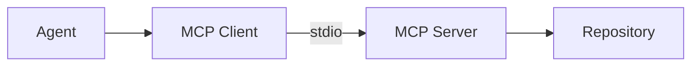

# Architecture

CodePilot separates UI, API, agent reasoning, and repository access.

| Layer | Package | Responsibility |
|-------|---------|----------------|
| Agent | `packages/agent` | LLM reasoning and tool use via `AgentRunner` (MCP client + Ollama) |
| MCP Client | `packages/agent` (`McpClientSession`) | Spawn/connect to the local MCP server, discover tools dynamically, call tools, close cleanly |
| MCP Server | `packages/mcp-server` | Repository capabilities only (`search_code`, `read_file`, `run_tests`, `get_diff`) |
| Repository | `REPO_ROOT` / `test-repository` | Target codebase under path-security constraints |

The agent must not hardcode repository tool names. It discovers the live tool list from MCP after connect.
