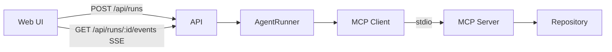

# Architecture

CodePilot separates UI, API, agent reasoning, and repository access.

| Layer | Package | Responsibility |
|-------|---------|----------------|
| API | `apps/api` | Validate requests, in-memory runs, SSE activity stream |
| Agent | `packages/agent` | LLM reasoning and tool use via `AgentRunner` (MCP client + Ollama) |
| MCP Client | `packages/agent` (`McpClientSession`) | Spawn/connect to the local MCP server, discover tools dynamically, call tools, close cleanly |
| MCP Server | `packages/mcp-server` | Repository capabilities only (`search_code`, `read_file`, `run_tests`, `get_diff`) |
| Repository | `REPO_ROOT` / `test-repository` | Target codebase under path-security constraints |

The agent must not hardcode repository tool names. It discovers the live tool list from MCP after connect.

## Why SSE for run activity

The UI needs a one-way stream of investigation progress (`run_started`, tool calls, completion/failure). **Server-Sent Events** fit that shape:

- Native browser `EventSource` / fetch streaming over plain HTTP
- Simple framing (`event`, `data`) without a second protocol stack
- Easy disconnect handling on request close
- Enough for a single-user local MVP

Alternatives rejected for this MVP:

- **WebSockets** — bidirectional complexity we do not need for agent→UI progress
- **Redis / brokers** — infrastructure overhead for in-process runs

SSE is not a durable multi-subscriber bus; events live in the API process memory for the lifetime of that run.
