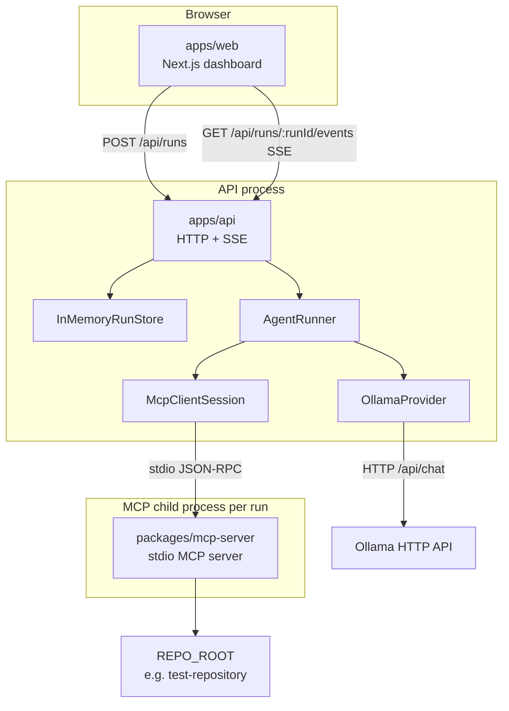
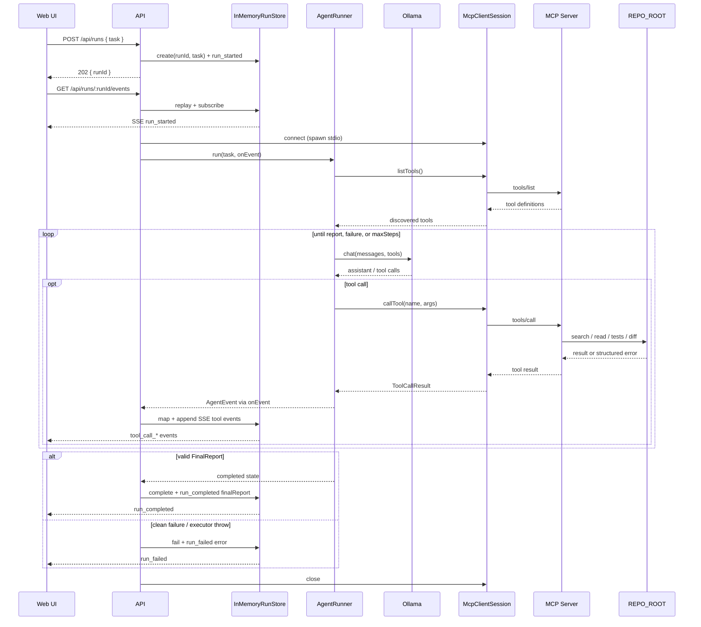
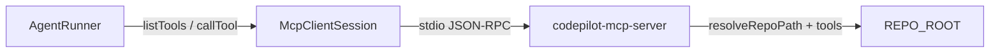
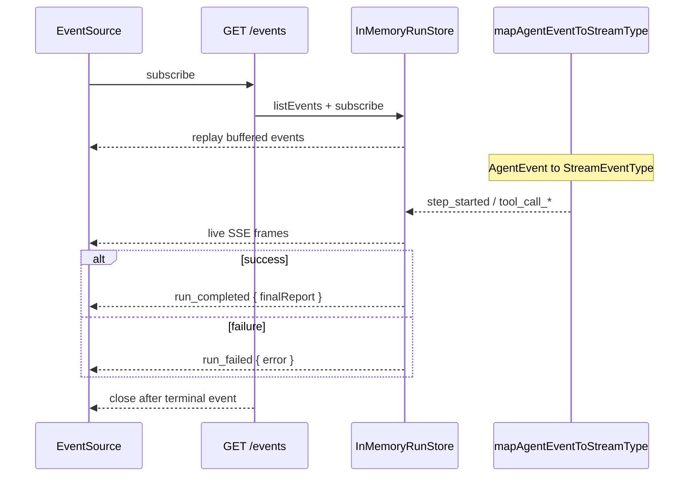
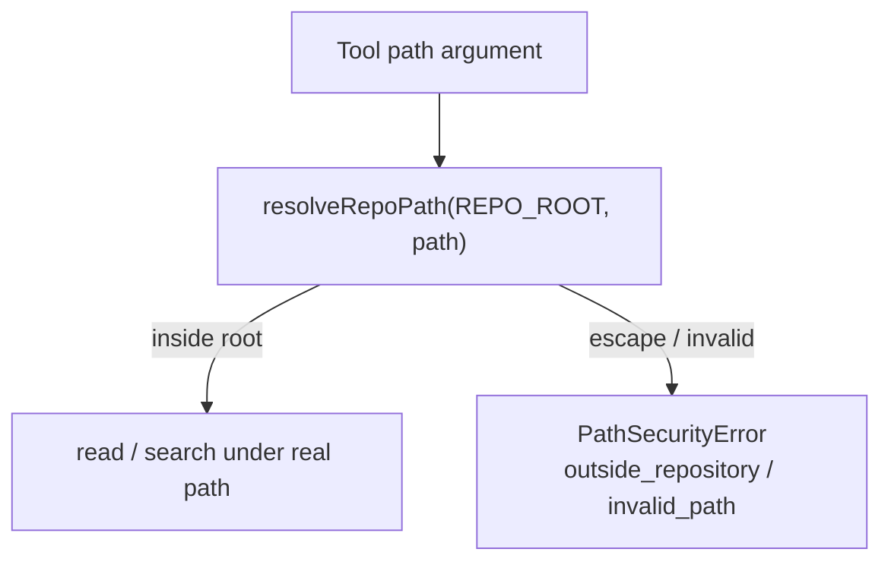

# Architecture

CodePilot is a local investigation stack: a Next.js UI starts runs through a thin HTTP/SSE API; the API runs `AgentRunner` in-process; the agent calls Ollama and reaches the target repository only through an MCP client that spawns a stdio MCP server.

Facts below match the current implementation in `apps/*` and `packages/*`. This is a local MVP, not a production multi-tenant system.

## System architecture

| Path | Package | Role |
|------|---------|------|
| `apps/web` | `@codepilot/web` | Single-page dashboard: task input, status, timeline, tool calls, final report, errors |
| `apps/api` | `@codepilot/api` | Request validation, in-memory runs, SSE stream, starts `AgentRunner` |
| `packages/agent` | `@codepilot/agent` | `AgentRunner`, in-memory `AgentState`, Ollama adapter, `McpClientSession` |
| `packages/mcp-server` | `@codepilot/mcp-server` | Repository tools over stdio; path security; no LLM reasoning |
| `test-repository/` | `mini-checkout` | Standalone sample target repo (not an npm workspace package) |

## Component responsibilities

### Web (`apps/web`)

- Calls `POST /api/runs` and subscribes with `EventSource` to `GET /api/runs/:runId/events`
- Renders run UI from SSE payloads
- Does **not** import `@codepilot/agent`, spawn MCP, or call Ollama

### API (`apps/api`)

- Validates `{ task }` with Zod
- Creates an in-memory run and returns `202 { runId }` immediately
- Runs the agent in the background; maps selected agent events into the store for SSE
- Applies CORS for `WEB_ORIGIN` so a browser origin can call the API (not an auth system)
- Does **not** contain investigation reasoning or repository I/O
- Does **not** expose a cancel/abort HTTP route (even though `AgentRunner` accepts `AbortSignal`)

Default executor wiring (`createDefaultAgentExecutor`):

1. Connect `McpClientSession` by spawning `node packages/mcp-server/dist/main.js` (or `MCP_SERVER_ENTRY`) over stdio
2. Pass `REPO_ROOT` and `TEST_COMMAND` into the child env
3. Construct `AgentRunner` with `OllamaProvider.fromEnv()` and the MCP session
4. Close the MCP session when the run finishes

Each default run therefore gets its own MCP child process for the duration of that run.

### Agent (`packages/agent`)

- Owns the investigation loop (`AgentRunner`)
- Talks to Ollama through `LlmProvider` / `OllamaProvider`
- Discovers and calls tools only through `AgentMcpPort` (`listTools`, `callTool`)
- Validates a structured `FinalReport` before completing
- Enforces in-process guardrails (max steps, tool timeout, result size, repeated identical calls, clean failure, optional `AbortSignal`)

### MCP client (`McpClientSession` in `packages/agent`)

- Spawns/connects to the MCP server with `StdioClientTransport`
- Lists tools dynamically from the live server (the runner does not hardcode tool names)
- Forwards `tools/call` and returns results to the runner
- Closes the session cleanly

### MCP server (`packages/mcp-server`)

- Registers a **fixed** set of repository capabilities today:

| Tool | Input | Behavior |
|------|-------|----------|
| `search_code` | `{ query }` | Recursive walk + substring match under `REPO_ROOT` (not ripgrep) |
| `read_file` | `{ path }` | Read a file under `REPO_ROOT` |
| `run_tests` | `{}` | Run host-configured `TEST_COMMAND` only |
| `get_diff` | `{}` | Run fixed `git diff --no-ext-diff --no-color HEAD` only |

- Enforces path security for filesystem tools
- Does **not** contain prompts, tool-selection policy, or LLM calls

“Dynamic discovery” means the client reads whatever the server currently registers. It does not mean tools are generated at runtime beyond that registration.

### Repository (`REPO_ROOT`)

- Trust boundary for path resolution and command cwd
- Default demo target is `test-repository` (intentional failing volume-discount tests)

## Data flow

### Final report shape

On successful completion, SSE `run_completed` carries `payload.finalReport` with:

`summary`, `rootCause`, `filesInspected`, `testsExecuted`, `testResult`, `confidence`, `uncertainty`, `investigated`, `identified`, `recommended`, `verified`

The agent must not claim it modified repository files; there is no write tool. Report validation includes a heuristic check against first-person modification claims—it is an honesty check, not a security control.

## Agent → MCP Client → MCP Server flow

Constraints enforced by the current code:

- Repository access from the agent goes through MCP only
- Tool names come from `tools/list`, not a hardcoded allowlist in the runner
- The server currently registers exactly four tools
- `run_tests` and `get_diff` accept empty input schemas; model-supplied command/git argv is not used to build the executed command
- Tool `isError` results are recorded; the loop may continue until a valid report or max steps
- Failure to `listTools` fails the run cleanly

## SSE flow

### Stream event names

| SSE `event` | Source |
|-------------|--------|
| `run_started` | Store on run create (`{ task }`) |
| `step_started` | Agent `step_start` |
| `tool_call_started` | Agent `tool_call` |
| `tool_call_completed` | Agent `tool_result` with `isError` false |
| `tool_call_failed` | Agent `tool_result` with `isError` true |
| `run_completed` | Store on successful complete (`{ finalReport }`) |
| `run_failed` | Store on failed state or executor throw (`{ error }`) |

Agent events such as `status`, `step_end`, `error`, `report`, and `done` are **not** mapped to SSE types; terminal UI state uses `run_completed` / `run_failed`.

Framing: `id`, `event`, `data` (JSON with `runId`, `timestamp`, `payload`). Events are held in process memory for that run; connecting after completion replays and closes. Client disconnect unsubscribes the in-memory listener.

## Repository security boundary

`resolveRepoPath` (`packages/mcp-server/src/security/path-guard.ts`):

- Requires non-empty root and path; rejects null bytes
- Resolves the repository root with `realpath` and requires a directory
- Resolves the candidate through existing ancestors (supports not-yet-created leaf paths when ancestors stay inside the root)
- Accepts the path only when the final location is inside the repository root
- Rejects traversal escapes, absolute paths outside the root, and symlink targets that leave the root

Additional command boundaries:

- `run_tests` executes only the host `TEST_COMMAND` argv (shell metacharacters rejected at parse time)
- `get_diff` executes only the fixed git argv above
- There is no MCP `write_file` tool

Operator trust assumptions:

- No API auth: network reachability implies ability to start runs
- A misconfigured `TEST_COMMAND` or `REPO_ROOT` is still dangerous; path guards constrain file tools, not arbitrary command power

## Why each component exists

| Component | Why it exists |
|-----------|----------------|
| Web dashboard | Give a local operator one page to start a task and watch investigation progress |
| Thin API | Separate browser transport (HTTP/SSE) from agent runtime without putting reasoning in the UI |
| In-memory run store | Track one-process run lifecycle and SSE subscribers without introducing persistence infrastructure |
| AgentRunner | Keep the investigation loop explicit and testable (LLM + MCP ports, max steps, guardrails) |
| Ollama adapter | Local model backend with no cloud API key in the default path |
| MCP client | Standard tool transport; spawn the capability server as a child process |
| MCP server | Isolate repository filesystem/shell/git capabilities behind schema-validated tools and path security |
| `test-repository` | Deterministic demo target with a known failing test |

## Why certain components intentionally do not exist

| Absent | Reason in this MVP |
|--------|--------------------|
| Database | Runs and events are short-lived and local; `InMemoryRunStore` is enough |
| Redis / message broker / queue | Single API process runs the agent; no multi-worker fan-out |
| Authentication | Local single-operator MVP |
| WebSockets | Progress is one-way agent→UI; SSE covers that without a bidirectional protocol |
| Agent frameworks / sub-agents | Explicit `AgentRunner` loop keeps control flow and failure modes visible |
| Direct FS/shell/git from the agent | All repository I/O goes through MCP so path and command policy stay in one place |
| `write_file` / mutation tools | Investigation and recommendation only; the agent must not modify the target repo |
| Durable multi-subscriber event bus | SSE buffers live in the API process for the lifetime of one run |
| Cancel HTTP API | Runner supports `AbortSignal`, but no product route wires it yet |

## Runtime wiring (env)

| Variable | Used by | Purpose |
|----------|---------|---------|
| `NEXT_PUBLIC_API_URL` | Web | API base URL (default `http://localhost:3001`) |
| `API_PORT` | API | Listen port (default `3001`) |
| `WEB_ORIGIN` | API CORS/SSE | Allowed browser origin (default `http://localhost:3000`) |
| `REPO_ROOT` | MCP (via API spawn env) | Repository trust root |
| `TEST_COMMAND` | MCP `run_tests` | Fixed trusted test argv |
| `OLLAMA_BASE_URL` | Agent | Ollama HTTP base |
| `OLLAMA_MODEL` | Agent | Model name |
| `MCP_SERVER_ENTRY` | API (optional) | Override MCP server entry script |

## Related docs

- `docs/agent-design.md` — agent state model, status transitions, and runner sequence detail
- `docs/decisions.md` — decision records and trade-offs
- `docs/workspace-layout.md` — package layout notes
- `README.md` — setup, tools, guardrails, testing strategy, example run
