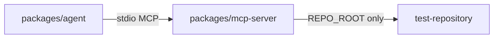

# Workspace layout

Current repository layout for CodePilot Agent:

```
apps/web            Next.js frontend (scaffold)
apps/api            HTTP API (scaffold)
packages/agent      Agent loop package (scaffold)
packages/mcp-server Stdio MCP server (`search_code` + path security)
test-repository     Standalone sample app (`mini-checkout`) for agent demos
docs                Project documentation
```



## MCP search approach

`search_code` uses a plain recursive filesystem walk and substring match. No ripgrep/glob dependency: the target repos are small local trees, and path checks already go through `resolveRepoPath`.

Install and run the sample separately:

```bash
cd test-repository && npm install && npm test
```
