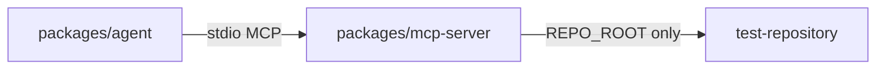

# Workspace layout

Current repository layout for CodePilot Agent:

```
apps/web            Next.js investigation dashboard
apps/api            HTTP API (`POST /api/runs`, SSE events, in-memory runs)
packages/agent      MCP client + state + Ollama adapter + AgentRunner
packages/mcp-server Stdio MCP server (four repo tools + path security)
test-repository     Standalone sample app (`mini-checkout`) for agent demos
docs                Project documentation
```



## MCP repository tools

- `search_code`: plain recursive filesystem walk and substring match (no ripgrep dependency). Trade-off: simple and dependency-light; weaker than dedicated code search on large trees.
- `read_file`: reads one file through `resolveRepoPath`, with a size cap and structured error codes.
- `run_tests`: fixed application-configured argv only (`TEST_COMMAND`); no LLM-supplied shell; timeout + bounded output.
- `get_diff`: fixed `git diff ... HEAD` only; empty-diff and non-git handling; bounded output.

Demo fixture note: the intentional bug lives in `test-repository/src/apply-discount.ts` (`>` vs `>=` at the $100 / 10000-cent threshold), covered by `tests/checkout.test.ts`.

Install and run the sample separately:

```bash
cd test-repository && npm install && npm test
```
